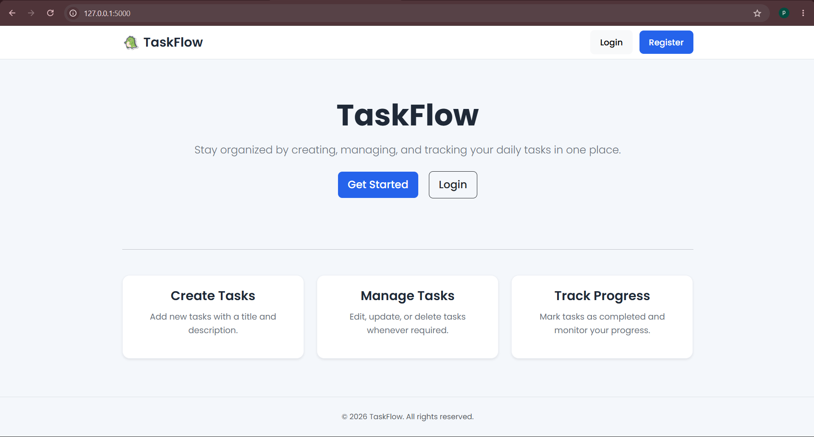
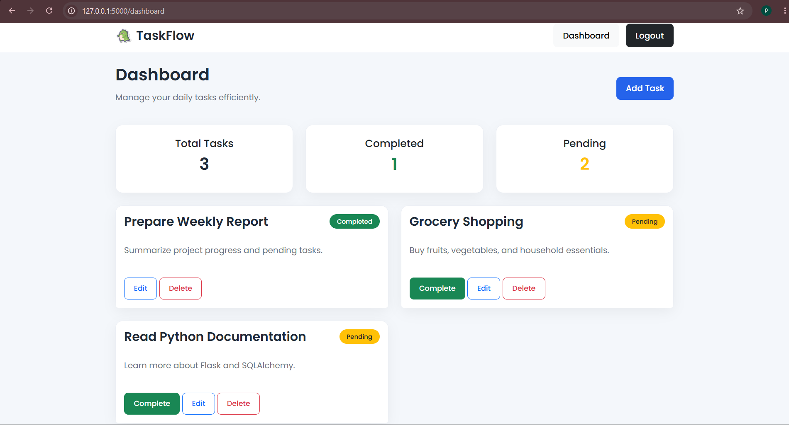
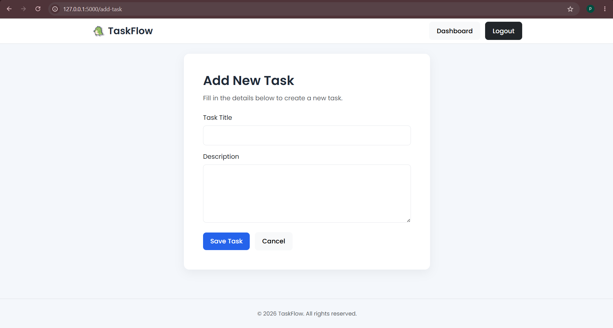

# TaskFlow

TaskFlow is a web-based task management application built with Flask. It allows users to register, log in, and manage their personal tasks through a simple and responsive interface.

## Features

- User Registration and Login
- Secure Password Hashing
- Session-based Authentication
- Create Tasks
- Edit Tasks
- Delete Tasks
- Mark Tasks as Completed
- User-specific Dashboard
- Responsive UI using Bootstrap

## Screenshots

### Home Page



### Dashboard



### Add Task



## Technologies Used

- Python
- Flask
- SQLAlchemy
- SQLite
- HTML
- CSS
- Bootstrap

## Installation

1. Clone the repository

```bash
git clone https://github.com/pretheka-pre/synent-task9-taskmanager-pretheka.git
```

2. Install dependencies

```bash
pip install -r requirements.txt
```

3. Run the application

```bash
python app.py
```

4. Open your browser and visit:

```
http://127.0.0.1:5000
```

## Project Structure

```
models/
static/
templates/
app.py
database.py
requirements.txt
```

## Author

Pretheka